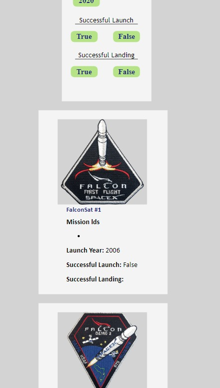
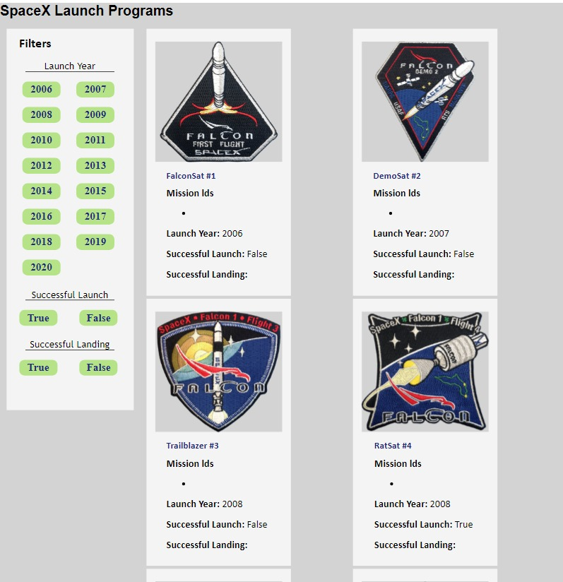
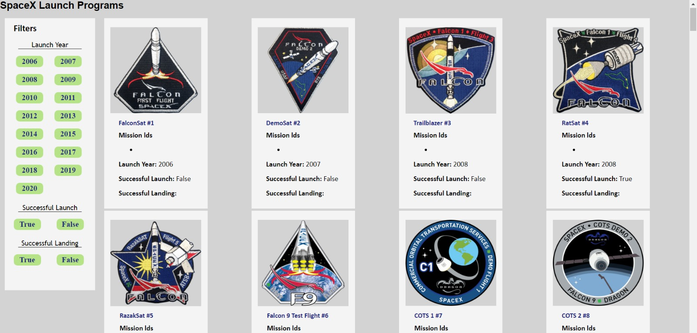

## SpaceX Launch Programs
This is a web page that displays information about SpaceX launch programs. It allows users to filter the launch programs based on various criteria such as launch year, successful launch, and successful landing.

### Introduction
This web page provides an interface to explore SpaceX launch programs. It includes a filter section where users can select specific launch years, successful launch status, and successful landing status. The launch programs are displayed as cards, each containing information about the mission, launch year, successful launch, and successful landing.

### Features
* Filter launch programs based on launch year.
* Filter launch programs based on successful launch status.
* Filter launch programs based on successful landing status.
* Display launch program cards with detailed information.

### Getting Started

To get a local copy up and running follow these simple example steps.
<br>

#### Prerequisites

These are dependencies you will need to install before running the API
* npm
  ```sh
  npm install npm@latest -g
  ```

#### Installation

1. Clone the repo
   ```sh
   git clone git@github.com:deepali-04/SpaceX-Prog.git
   ```
2. Install NPM packages
   ```sh
   npm install
   ```
3. Run the app
    ```sh
    npm start
    ```

### Technologies Used
The following technologies were used to develop this web page:
React.js
CSS

### Screenshots

Mobile View


Tablet View


Desktop View
